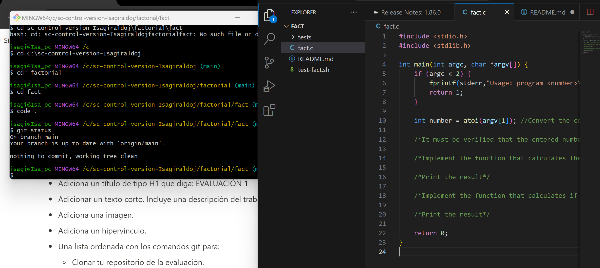

# EVALUACIÓN 1

El primer punto de la evaluacion fue clonar el repositorio a nuestro computador con git clone, de ahi abrimos las carpetas factorial/fact con el comando cd.
Abrimos el codigo con code . para ver el codigo en visual studio y modificamos el código. 

El siguiente paso fue darle git status donde nos envio el mensaje de que se habia realizado un cambio, asi que hicimos git commit -a "primer punto de la evaluación" y ya nuestro repo quedo al dia con los cambios.

La pagina donde estan las instrucciones de la evaluacion es la siguiente:
https://confusion-snapper-025.notion.site/Evaluaci-n-Git-Github-y-Github-Classroom-60071e3da54b4f6a871a5715ce383fc4

haciendo una recapitulacion de los comandos para cada paso:
 * git clone
 * git add
 * git commit
 * git push
 
